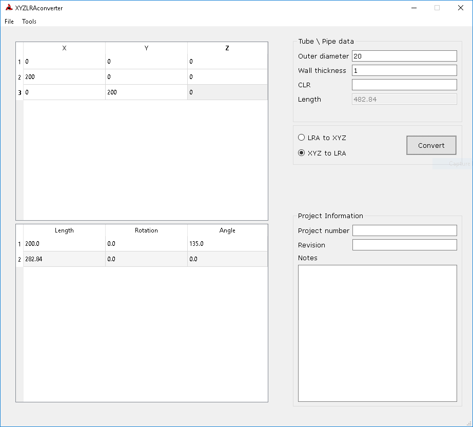

# xyz-lra-converter

xyz-lra-converter is a simple program that generates Length Rotation Angle (LRA) bender data of a tube from
it's coordinate points (XYZ).

This program is written in python using PyQt5. Tested under windows with python 3.6.

## GUI
Python module XYZLRAConvert.py provides the GUI:

## Including in other program

Python module convertX2L.py provides the calculation engine:
   - a function `xyz2lra` to convert XYZ coordinates to LRA, e.g.:

            data = [[0, 0, 0], [200, 0, 0], [0, 200, 0]]
            res = xyz2lra(data, clr=5)
            print(res)
   - a function `lra2xyz` to LRA coordinates to XYZ
   - a class `transform` to convert from one to the other with other options
